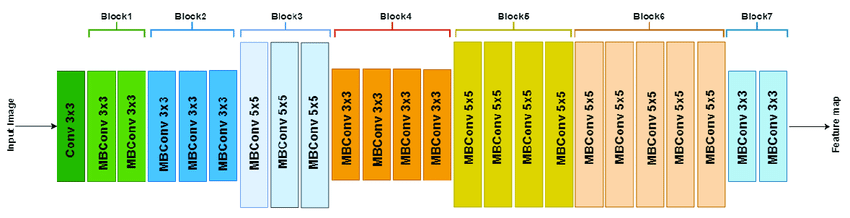
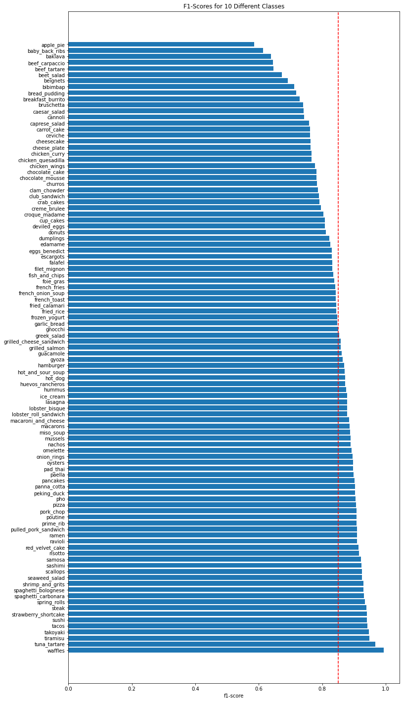
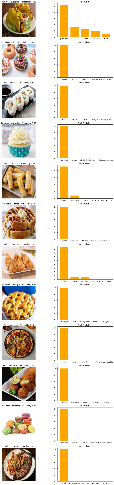

# Food Vision 101 - Computer Vision :hamburger: :camera:

An end to end multiclass image classification project(web app) for 101 classes of food. Built with TensorFlow and Reactjs. [Visit Web app](https://princewilling.github.io/food-vision-101-tensorflow-and-reactjs/)


## Introduction

Deep learning is a vast field with numerous applications. In this project i'd be building an **ended to ended** multi-class image classification system to classify 101 diffrent classes of food type. I'll be implementing the popular **CNN network** while utilizing the full power of **feature extraction**,**fine tuning** and **transfer learning** to extract features and fine-tune layers.

As an introductory project to myself, I capitalized on using a pretrained Image Classification Model that's available on **TF HUB** and then retrained it on the famous **Food101 Dataset**.
...more

## Aim

Apart from building an end to end image classification system, the sole aim of the project is to beat the DeepFood Paper's model which is also trained on the same dataset(Food101).

### Note

The Accuracy of [**DeepFood**](https://arxiv.org/abs/1606.05675) was about **77.4%** and our model's is about **82%**. Difference of **9%** ain't much, but the interesting thing is, DeepFood's model took 2-3 days to train while our's was around 40min.
> **Dataset :** `Food101`
> **Model :** `EfficientNetB1`

## Technologies used:

* Python
* TensorFlow, Tensorflowjs & TensorFlow Hub
* Reactjs
* Nodejs
* Scikit Learn
* Git
* Ipython notebook
* Streamlit

## Run & Setup

Visit [**the web app**](https://princewilling.github.io/food-vision-101-tensorflow-and-reactjs/) to see the project in action and try it out for your self

### Locally

To run this project, install it locally using npm:

``` 
$ git clone https://github.com/princewilling/food-vision-101-tensorflow-and-reactjs 
$ cd ../food-vision-101-tensorflow-and-reactjs
$ npm install
$ npm start
```

## Build Up

Visit notebook @ [`modeling.ipynb`](https://github.com/princewilling/Food_Vision_101/blob/main/modeling.ipynb)

### Dataset

The dataset used for this project is available on tensorflow datasets(tfds) collections. Someone else went through the hard work of cleaning and converting the image dataset into tensors. so that I didn't have to. The dataset included 101 classes of food with about 1000+ training images of each classes. Although class imbalance did exist in the training data, it did not substantially affect the model performance.

### Model Architecture



A EfficientNetB1 model was used as the model for this project. Due to the fact that this model has been so successful in so many image classification competitions in the past and my best EfficientNet model score was good enough for me, I did not explore any other model architectures. The model weights were initially trained on the [ImageNet Dataset](https://en.wikipedia.org/wiki/ImageNet). However, I decide to retrain the whole layers of the model since I had access to a large amount of dataset. This allowed me to train this model and iterate through hyperparameter combinations much more quickly than would have been possible otherwise. I also used my own implementation of [early stopping](https://en.wikipedia.org/wiki/Early_stopping) and [learning rate callback](https://www.tensorflow.org/api_docs/python/tf/keras/callbacks/ReduceLROnPlateau) to prevent overfitting and decrease training time and learning rate. Tensorflow was my weapon of choice as a programming framework because of the ease of use and amount of model customization possible.

#### Becoming one with the Data : Visualise - Visualize - Visualize

### Set up

Setup Global dtype policy to **`mixed_float16`** to implement [**Mixed Precision Training**](https://www.tensorflow.org/guide/mixed_precision)
Mixed precision is the use of both 16-bit and 32-bit floating-point types in a model during training to make it **run faster** and use **less memory**.

#### Building the Feature extraction & Model Callbacks

As we are dealing with a complex Neural Network (EfficientNetB1) its a good practice to have few callbacks set up. Few ones I will be using throughtout this Notebook are :

- **TensorBoard Callback :** TensorBoard provides the visualization and tooling needed for machine learning experimentation
- **EarlyStoppingCallback :** Used to stop training when a monitored metric has stopped improving.
- **ReduceLROnPlateau :** Reduce learning rate when a metric has stopped improving.

Applied transfer learning to build a  [Fine Tuning](https://www.tensorflow.org/tutorials/images/transfer_learning)  Model
> Again if you want to dive deeper on how the model was trained, check out **[`modeling.ipynb`](https://github.com/princewilling/Food_Vision_101/blob/main/modeling.ipynb) Notebook**

#### Model Results

* Training accuracy, weighted recall, weighted precision, and weighted F1 scores were all .85
* Validation scores were all .85
* Holdout test scores were all .84
* Among all training images, the model had the hardest time classifying apple pie, baby back ribs, bakalava, beef carpaccio, beef tartare
* Recall score less than .58 and F1 score less than .66
* Most frequently mistook them for other food classes

### Deploymet

After succesfully building my model. I converted my model into tensorflowjs format, where I was able to build an intaractive UI using Reactjs around my model to enable easy user accessibility. I choosed github pages as my deployment platform.



